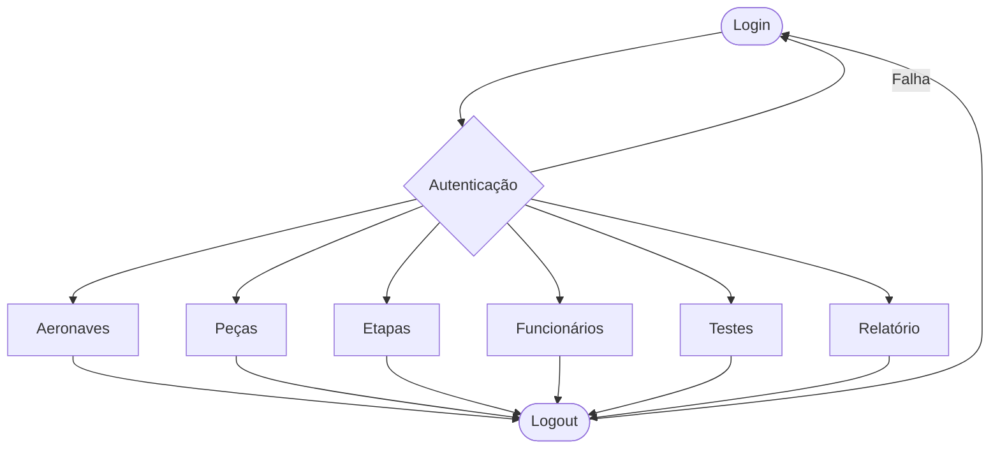

# AeroCode — AV2

---

## Requisitos e Público-alvo

O sistema foi concebido para apoiar o acompanhamento do ciclo de produção e manutenção de aeronaves, centralizando informações operacionais em um único painel. A partir das telas e fluxos implementados, as principais necessidades atendidas são:

- Controle de acesso por perfil (Administrador, Engenheiro e Operador), com permissões específicas para cada ação.
- Gestão de aeronaves com cadastro, edição, remoção e consulta de dados técnicos e status.
- Gestão de peças com acompanhamento de vínculo por aeronave, tipo e situação operacional.
- Gestão de etapas do processo com atualização de status e validação de sequência de execução.
- Gestão de funcionários para organização de equipe e associação de responsabilidades.
- Registro de testes técnicos e seus resultados para rastreabilidade de conformidade.
- Emissão e consulta de relatórios para suporte à análise e tomada de decisão.
- Área de perfil de usuário para manutenção de credenciais básicas.

Público-alvo:

- Engenheiros de Produção.
- Engenheiros Aeronáuticos.
- Administradores e operadores.

---

## Fluxo de Usuário

---

## Telas

### Login

---

### Menu Principal

---

### Menu — Aeronaves

---

### Menu — Peças

---

### Menu — Etapas

> Regra: etapa só pode ser iniciada se a anterior estiver `CONCLUÍDA`.

---

### Menu — Funcionários

---

### Menu — Testes

---

### Modal de Ação

---

### Perfil do Usuário

---

### Notificações

